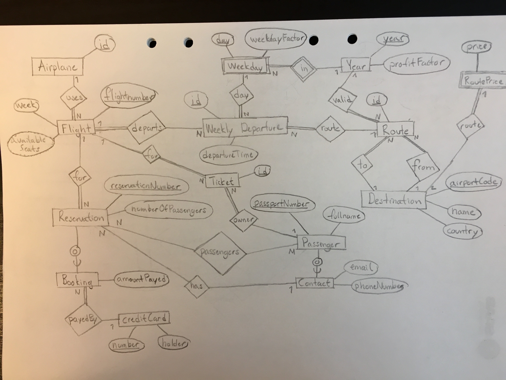
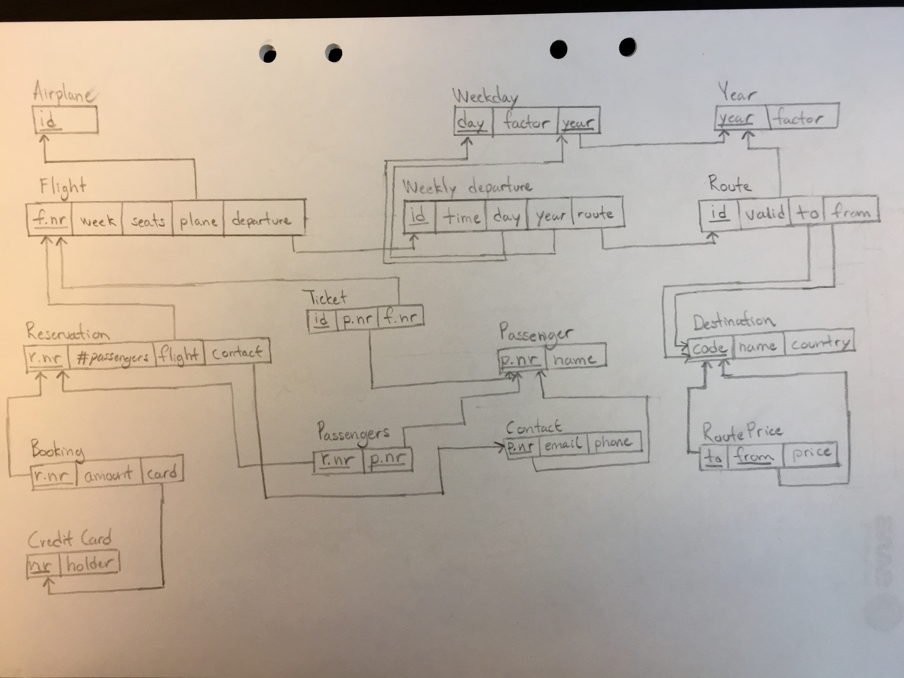

# Lab 4a, Viktor Holmgren (vikho394) and Yousif Touma (youto814)

## EER-diagram
See attached image

The following assuptions has been made:
- A Booking entry cannot be instantiated if the contact attribute in the reservation table for the superclass entry is null
- The `availableSeats` attribute could be modeled as an derived attribute. We however chose to include it as a physical attribute

## Relational model
See attached image

## Relational properties

|Name   	          |FD   	                                                                  |CK   	                   |PK   	        |NF   	|
|------------------	|------------------------------------------------------------------------ |------------------------- |-------------	|-----	|
|Airplane           |-   	                                                                    |id  	                     |id   	        |BCNF   |
|Flight 	          |(f.nr -> week, seats, plane, departure), (week, departure -> f.nr)       |f.nr, (week, departure)   |f.nr	        |BCNF   |
|Weekday   	        |day,year -> factor   					                                          |(day,year)                |(day,year)    |BCNF   |
|Year   	          |year -> factor   						                                            |year   	                 |year          |BCNF   |
|Weekly departure   |id -> time, day, year, route                                             |id                        |id            |BCNF   |
|Route              |(id -> valid, to, from), (to, from, valid -> id)                         |id, (to, from, valid)     |id            |BCNF   |
|Route price        |to,from -> price                                                         |(to, from)                |(to, from)    |BCNF   |
|Ticket             |id -> p.nr, f.nr                                                         |id                        |id            |BCNF   |
|Reservation        |r.nr -> #passengers, flight, contact                                     |r.nr                      |r.nr          |BCNF   |
|Booking            |r.nr -> amount, card                                                     |r.nr                      |r.nr          |BCNF   |
|Credit card        |nr -> holder                                                             |nr                        |nr            |BCNF   |
|Passengers         |-                                                                        |(r.nr, p.nr)              |(r.nr, p.nr)  |BCNF   |
|Passenger          |p.nr -> name                                                             |p.nr                      |p.nr          |BCNF   |
|Contact            |(p.nr -> email, phone), (email, phone -> p.nr)                           |p.nr, (email, phone)      |p.nr          |BCNF   |
|Destination        |(code -> name, country), (name, country -> code)                         |code, (name, country)     |code          |BCNF   |

**Dashes indicate that there only exists FD where the left side contains all attributes**.

## Images

